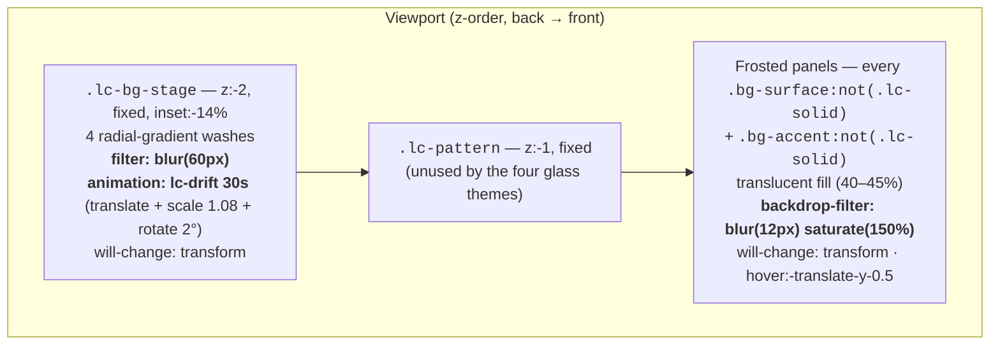
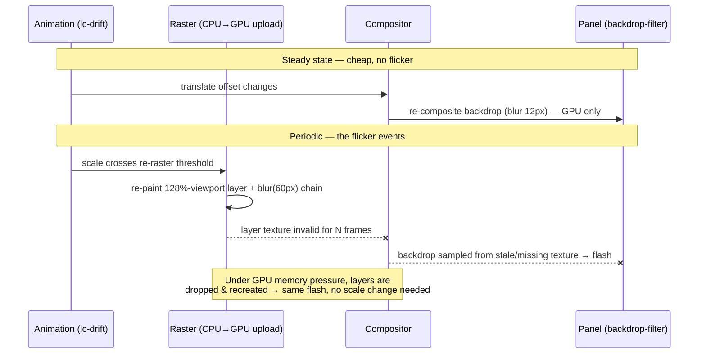
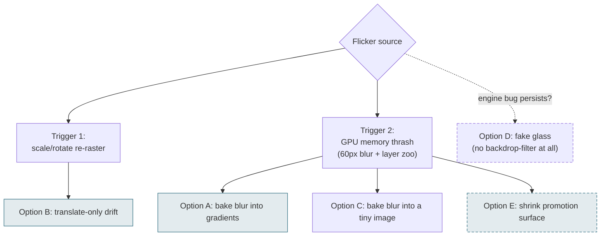
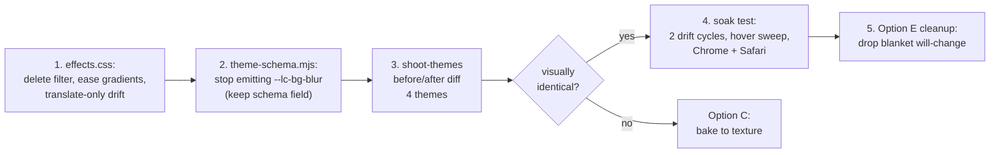

# Eliminating Glass-Button Flicker In The Atmosphere Themes

> **Status:** Exploration #10. A bug-focused follow-on to
> [`0007_[_]_EXPRESSIVE_THEMES_AND_FLOURISHES.md`](./0007_[_]_EXPRESSIVE_THEMES_AND_FLOURISHES.md)
> (which built the effect library) and
> [`0009_[x]_FROST_FAMILY_THEMES.md`](./0009_[x]_FROST_FAMILY_THEMES.md) (which
> shipped Mist, Dawn, and Dusk alongside Frost). All four atmosphere themes
> occasionally make the buttons **flicker rapidly**. The brief: kill the flicker
> **without losing any of the detail** of the frosted-glass-over-drifting-mesh
> effect. The effect is good; the flicker is not.

## Problem Statement

On the four glass themes — [`frost`](../../themes/frost.yaml),
[`mist`](../../themes/mist.yaml), [`dawn`](../../themes/dawn.yaml),
[`dusk`](../../themes/dusk.yaml) — the link buttons (and the other frosted
panels) intermittently flicker: a rapid shimmer or flash, sometimes a
frame or two where the glass appears to lose or re-acquire its blur. It is
not constant; it comes in bursts "occasionally," which is the signature of a
**GPU layer being torn down and re-rasterized mid-animation**, not of a steady
per-frame cost.

A first flicker fix already landed
(commit `230e843`, *"fix(themes): stop frosted-glass panels flickering on hover
and over time"*): it pinned the mesh stage and every frosted panel to their own
compositor layers (`will-change: transform` + `backface-visibility: hidden`,
[`effects.css:27–33`](../../src/styles/effects.css#L27) and
[`effects.css:86–100`](../../src/styles/effects.css#L86)). That helped the
*hover* case but the *over-time* flicker still recurs. This exploration digs to
the actual root cause and proposes a fix that removes the flicker **by
construction** rather than by hinting the compositor harder.

## Executive Summary

**The flicker is caused by stacking three GPU-expensive things on top of each
other, two of which force periodic re-rasterization:**

1. A **live 60px `filter: blur()`** applied every raster pass to a fixed layer
   that is oversized to ~128% of the viewport
   ([`effects.css:15–33`](../../src/styles/effects.css#L15)) — at 2× DPI on a
   laptop this is a multi-hundred-megapixel intermediate texture chain.
2. A **transform animation that includes `scale(1.08)` and `rotate(2deg)`**
   ([`effects.css:39–43`](../../src/styles/effects.css#L39)). Translate-only
   transforms stay on the compositor; **scale changes are exactly what makes
   browsers re-rasterize a layer** to keep it sharp. Every re-raster of a
   blurred 128%-viewport layer is a heavyweight event.
3. **A dozen-plus `backdrop-filter: blur(12px)` panels** (every
   `bg-surface`/`bg-accent`, [`effects.css:68–85`](../../src/styles/effects.css#L68))
   whose backdrops must be re-composited from that layer every frame, each in
   its own render surface — plus blanket `will-change: transform` promotion on
   all of them, which multiplies retained GPU texture memory.

Under GPU memory pressure, Chrome (and to a lesser degree Safari) drops and
recreates these layers — each drop/recreate is a visible flicker frame. This is
a well-documented Chromium failure mode for large backdrop-filters over
animated content (see [External Research](#external-research)).

**Recommendation — remove the two re-raster triggers; keep the glass exactly
as it is:**

- **R1. Bake the mesh softness into the gradients** and delete the live
  `filter: blur(60px)` from `.lc-bg-stage`. A 60px Gaussian blur of four soft
  radial gradients is visually ≈ four *softer* radial gradients — the blur
  contributes almost nothing that eased gradient falloff can't reproduce, and
  it is by far the biggest GPU line-item.
- **R2. Make the drift translate-only** (drop `scale`/`rotate`), compensating
  with a slightly larger stage overscan. Translate-only transform animation
  never invalidates the layer's raster.
- **R3. Keep `backdrop-filter: blur(12px) saturate(150%)` on the panels
  untouched** — that *is* the glass detail the user likes, its radius is small,
  and once its backdrop is a cheap stable layer it has nothing left to flicker
  against.

Net: the effect looks the same (validated by a before/after screenshot diff
with the existing [`shoot-themes.mjs`](../../scripts/shoot-themes.mjs)), the
data contract in `themes/*.yaml` is unchanged, and the flicker's mechanical
causes are gone rather than papered over.

## Current State In The Repository

### The rendering stack

Three layers cooperate to make a glass theme
([`Layout.astro:58–59`](../../src/layouts/Layout.astro#L58) mounts the first
two whenever any theme in the switcher cycle needs them):



- **The mesh stage** — [`effects.css:15–44`](../../src/styles/effects.css#L15).
  `position: fixed; inset: -14%` (≈128vw × 128vh), four radial gradients from
  the theme's `--lc-mesh-*` vars, then `filter: blur(var(--lc-bg-blur))`. All
  four glass themes set `blur: 60` and `animate: true` in their YAML, so the
  stage also runs `lc-drift`: 30s ease-in-out infinite alternate to
  `translate3d(-3%, -2%, 0) scale(1.08) rotate(2deg)`.
- **The glass panels** — [`effects.css:68–100`](../../src/styles/effects.css#L68).
  The `bg-surface` utility itself is targeted, so *every* panel frosts: link
  buttons, the social row, the card reveal, FAQ, forms, the switcher. Each gets
  `backdrop-filter: blur(12px) saturate(150%)` (emitted by `themeToCss()`,
  [`theme-schema.mjs:268–278`](../../src/lib/theme-schema.mjs#L268)) plus the
  prior fix's `will-change: var(--lc-glass-promote)` → `transform` on glass
  themes.
- **The buttons move on hover** —
  [`LinkButton.astro:32`](../../src/components/LinkButton.astro#L32) uses
  `transition hover:-translate-y-0.5 hover:shadow-md` (same pattern on the
  star button at line 48, `SaveContact`, socials, etc.).
- **The theme data** — each of the four YAMLs:
  `background: {kind: pastel-mesh, stops: […4 colors…], blur: 60, animate: true}`
  and `buttons: {fill: glass, glassFillOpacity: 0.4–0.45}`. The schema allows
  `blur: 0–120` ([`theme-schema.mjs` `backgroundSchema`](../../src/lib/theme-schema.mjs#L98)).
- **Existing guards** — `prefers-reduced-motion` pauses the drift
  ([`effects.css:34–38`](../../src/styles/effects.css#L34));
  `prefers-reduced-transparency`, `forced-colors`, and a `@supports` fallback
  all collapse glass to opaque ([`effects.css:103–135`](../../src/styles/effects.css#L103)).
- **The contrast gate is blur-agnostic** —
  [`check-contrast.mjs:96–120`](../../scripts/check-contrast.mjs#L96)
  composites the surface fill over the mesh stops at `glassFillOpacity`; it
  never models the blur filter. Changing how the blur is produced cannot
  regress the AA gate.

### What the prior fix did (and why it wasn't enough)

Commit `230e843` promoted the stage and every frosted panel to their own
compositor layers. That is the standard first-line remedy and it did fix the
*hover-lift* flicker (the panel now animates `translate` on its own retained
layer). But it also **increased** total retained GPU memory: one enormous
blurred layer + one render surface per frosted panel, all pinned. The
"over time" flicker persists because promotion doesn't remove the two events
that force rework:



Two distinct triggers, same symptom:

1. **Scale-driven re-raster.** Browsers rasterize a layer at a chosen scale;
   when a transform animation *changes* scale, they periodically re-rasterize
   so the texture isn't blurry-stretched. `will-change: transform` asks Chrome
   to lock the raster scale, but that lock interacts badly with a 60px filter
   (huge locked textures) and isn't honored uniformly across
   browsers/zoom/DPR. Every re-raster of this particular layer is expensive
   enough to miss frames, and every miss is visible *through* the
   backdrop-filters in front of it.
2. **GPU memory-pressure layer thrash.** blur(60px) needs a chain of large
   intermediate textures (downscale→blur→upscale). At 2× DPR on a 1600×1000
   viewport the stage layer alone is ~2050×1280 CSS px → ~4100×2560 device px
   ≈ 42 MB RGBA *before* the filter chain's intermediates — plus a render
   surface per frosted panel. When the GPU process trims memory, layers get
   purged and recreated; recreation takes frames; the glass flashes.

## External Research

- **Chromium's tracked bug for exactly this**:
  [Issue 339841685 — "CSS `backdrop-filter: blur()` rendering issue: flicker on scroll"](https://issues.chromium.org/issues/339841685)
  — backdrop-filter panels flicker when the content behind them
  moves/scrolls; confirmed engine-side, not author error.
- **Jim Fisher, ["On that flickering blur in Chrome"](https://jameshfisher.com/2024/04/23/backdrop-blur-without-the-flickering/)**
  — analyzes the same rapid backdrop-filter flicker and demonstrates the
  nuclear workaround: don't use `backdrop-filter` at all; paint a blurred
  *copy* of the known background inside the panel and clip it. (Our Option D.)
- **Blink PSA on backdrop-filter edge sampling**:
  [Update CSS backdrop-filter to use mirror edgeMode](https://groups.google.com/a/chromium.org/g/blink-dev/c/ZtMnFCHZhMQ/m/ewdpvCq_AQAJ)
  — when a backdrop-filtered element's edge crosses differently-colored
  moving content, sampling artifacts show up as "extreme flicker"; Chrome
  changed edge modes to mitigate. Confirms moving-backdrop + blur is the
  hazardous combination.
- **Webflow community reports** ([forum thread](https://discourse.webflow.com/t/backdrop-filter-blur-adds-flickering-on-chrome/231666),
  [flowradar answer](https://www.flowradar.com/answer/how-to-reduce-flickering-caused-by-blurred-items-with-large-backdrop-filters-on-chrome-when-using-webflow))
  — consistent field guidance: keep backdrop-filtered elements small, keep
  blur radii low, **never animate transform/filter on or under large
  backdrop-filters**, keep filter layers static.
- **Surma, ["Layers and how to force them"](https://surma.dev/things/forcing-layers/)**
  — documents the `will-change: transform` resolution-locking behavior and its
  GPU-memory side effects; recommends `backface-visibility: hidden` or
  `will-change: opacity` when the element's transform doesn't actually change,
  because their side effects are milder.
- **MDN [`will-change`](https://developer.mozilla.org/en-US/docs/Web/CSS/will-change)**
  — explicit anti-pattern warning: applying it to many elements hurts more
  than it helps; browsers already optimize aggressively.

The literature converges on a hierarchy: *prefer a static, cheap backdrop*
over *hinting layers harder*, and reserve "fake the glass with a painted
blurred copy" for when the engine bug simply can't be avoided.

## Key Findings

1. **The 60px blur is doing almost no visual work.** The mesh is four *soft
   radial gradients* — already low-frequency content. Gaussian-blurring a soft
   radial gradient yields… a slightly softer radial gradient. The blur exists
   to hide the gradients' band edges (`transparent 72%` hard-ish falloff at
   [`effects.css:22–25`](../../src/styles/effects.css#L22)). Eased multi-stop
   falloff reproduces this for free, with zero per-frame cost.
2. **`scale(1.08) rotate(2deg)` in the drift is the periodic trigger.** A
   translate-only transform is pure compositor work forever; adding scale
   invites raster-scale management, which for this layer means re-running the
   giant blur. The scale/rotate components of a 30s drift are barely
   perceptible; the translate is what reads as "drift."
3. **The panels' 12px backdrop blur is innocent — given a stable backdrop.**
   Small-radius backdrop-filter over a static (or translate-only composited)
   backdrop is the well-trodden path every macOS-style UI uses. The detail the
   user wants to keep lives here, and it can stay.
4. **The prior fix's blanket `will-change: transform` on every panel is
   over-promotion.** With the backdrop made cheap and stable, the panels no
   longer need speculative layer pinning; `backface-visibility: hidden` alone
   (the milder hint) plus the transition-time promotion the browser does
   anyway covers the hover lift. Fewer pinned layers → less memory pressure →
   less thrash. (Worth keeping only if hover-flicker reappears in testing.)
5. **Nothing in the validation pipeline blocks this.** The contrast gate
   composites colors, not filters; the schema's `blur` field can keep its
   meaning ("how soft is the mesh") with the *implementation* switching from a
   live filter to baked gradient softness. No YAML changes; community themes
   keep working.

## Options And Tradeoffs



| Option | What changes | Flicker impact | Fidelity risk | Cost / complexity |
| --- | --- | --- | --- | --- |
| **A. Bake softness into gradients** — delete `filter: blur()` from `.lc-bg-stage`, ease the gradient falloff instead | [`effects.css`](../../src/styles/effects.css) only (+ stop emitting `--lc-bg-blur` filter use) | Removes the biggest GPU consumer → kills memory-thrash flicker | Low — soft blobs ≈ blurred soft blobs; verify with screenshot diff | Tiny; pure CSS |
| **B. Translate-only drift** — drop `scale(1.08) rotate(2deg)`, bump overscan `inset: -14% → -16%`, slightly larger translate | [`effects.css:39–43`](../../src/styles/effects.css#L39) | Removes the periodic re-raster trigger entirely | Near-zero — at 30s the scale/rotate are imperceptible | Tiny; pure CSS |
| **C. Bake the mesh to a pre-blurred texture** — build step renders each theme's mesh, blurs with sharp, emits a ~64px AVIF upscaled by the browser | [`gen-themes.mjs`](../../scripts/gen-themes.mjs) + CSS | Same as A (static cheap backdrop) | None — a *true* Gaussian blur, pixel-faithful | Medium: binary assets per theme, theme-switcher must swap `--lc-mesh-img`, community-theme story gets heavier |
| **D. Fake the glass** (Jim Fisher) — drop `backdrop-filter`; each panel paints its own blurred copy of the mesh, clipped | New CSS machinery per panel | Immune to every backdrop-filter engine bug, by construction | Glass no longer refracts *real* content behind it (fine here — only the mesh is behind panels) | High: `background-attachment: fixed` is broken on iOS Safari, so it needs a transform-tracked inner element; hover-lift parallax edge cases |
| **E. Right-size layer promotion** — keep `backface-visibility: hidden` on panels, drop blanket `will-change: transform` (or scope it to `:hover` transitions) | [`effects.css:86–100`](../../src/styles/effects.css#L86), [`theme-schema.mjs:268`](../../src/lib/theme-schema.mjs#L268) | Reduces pinned GPU memory → fewer purge/recreate cycles | None visually | Tiny, but must re-test the hover case the prior fix addressed |
| **F. Do less** — lower `blur:` in YAML, `animate: false` | Theme YAML only | Helps, doesn't fix; static mesh loses the drift | Loses the living quality the user likes | Zero |

**Why not C first?** It's the highest-fidelity version of A, but it complicates
the "a theme is one YAML file" story from exploration #9 (binary asset per
theme, registry plumbing, switcher swaps). A is 95% of the benefit for 5% of
the cost — and if the screenshot diff after A shows visible banding or lost
softness, C is the documented escalation path with the pipeline
([`sharp` is already a dependency](../../package.json)) ready for it.

**Why not D first?** It's the only option that sidesteps the engine entirely,
but it's a rewrite of the glass mechanism with its own mobile-Safari landmines.
A+B remove both concrete triggers we can name; D stays in the back pocket for
"Chromium still flickers over a static backdrop" (which the field reports say
it does not).

## Recommendation

Ship **A + B together** (they are a handful of lines in one file), with **E**
as an included cleanup, and validate with the existing screenshot tooling.
Keep C and D as documented escalation paths.



Specifics:

1. **Gradient easing replaces the filter.** Each wash becomes a 3-stop
   gradient (full color → 55% color → transparent) so the falloff is smooth
   without any filter. The stage keeps `will-change: transform` — now it's a
   *cheap* pinned layer animating translate only, the textbook case.
2. **The `blur` schema field stays** (community themes validate unchanged) and
   is reinterpreted as "mesh softness." For now all shipped themes use 60 and
   the CSS easing is fixed; if a future theme wants sharper blobs, `themeToCss()`
   can map `blur` → a `--lc-mesh-fade` percentage. Document this in
   [`themes/README.md`](../../themes/README.md).
3. **Drift keyframes**: `translate3d(-3.5%, -2.5%, 0)` only; `inset: -16%` so
   the larger translate still never reveals an edge. Amplitude slightly raised
   so the motion doesn't feel diminished by losing scale/rotate.
4. **Panels untouched where it counts**: `blur(12px) saturate(150%)`,
   fill opacities, borders, CTA frosting — all identical. Only the speculative
   `will-change: transform` promotion is narrowed (keep
   `backface-visibility: hidden`, which is the documented backdrop-filter
   flicker remedy with the mildest side effects).

## Example Code

The whole fix, in [`src/styles/effects.css`](../../src/styles/effects.css):

```css
/* === Pastel-mesh background ============================================ */
/* Softness is BAKED into eased gradient falloff — no live filter. A 60px blur
   of a soft radial wash is visually a slightly-softer wash; easing the stops
   gets there with zero per-frame GPU cost, which is what stops the frosted
   panels in front from ever re-sampling a half-rasterized backdrop. */
.lc-bg-stage {
  position: fixed;
  inset: -16%; /* overscan covers the translate-only drift */
  z-index: -2;
  pointer-events: none;
  background-color: var(--lc-bg);
  background-image:
    radial-gradient(70% 65% at 12% 8%,
      var(--lc-mesh-1, transparent) 0%,
      color-mix(in oklab, var(--lc-mesh-1, transparent) 55%, transparent) 45%,
      transparent 82%),
    radial-gradient(70% 65% at 88% 12%,
      var(--lc-mesh-2, transparent) 0%,
      color-mix(in oklab, var(--lc-mesh-2, transparent) 55%, transparent) 45%,
      transparent 82%),
    radial-gradient(75% 70% at 16% 92%,
      var(--lc-mesh-3, transparent) 0%,
      color-mix(in oklab, var(--lc-mesh-3, transparent) 55%, transparent) 45%,
      transparent 82%),
    radial-gradient(75% 70% at 90% 88%,
      var(--lc-mesh-4, transparent) 0%,
      color-mix(in oklab, var(--lc-mesh-4, transparent) 55%, transparent) 45%,
      transparent 82%);
  /* No filter: the layer rasters once and then only composites. */
  will-change: transform;
}

@media (prefers-reduced-motion: no-preference) {
  .lc-bg-stage {
    animation: lc-drift 30s ease-in-out infinite alternate;
    animation-play-state: var(--lc-bg-anim, paused);
  }
  /* Translate-only: never triggers raster-scale management, so the layer's
     texture is immortal — the panels' backdrop-filter always has a valid
     backdrop to sample. (scale/rotate here were the periodic flicker trigger.) */
  @keyframes lc-drift {
    to {
      transform: translate3d(-3.5%, -2.5%, 0);
    }
  }
}
```

And the panel promotion narrowed (Option E):

```css
/* backface-visibility alone is the mild, documented backdrop-filter flicker
   remedy; blanket will-change:transform on every panel pinned a dozen render
   surfaces and fed the GPU-memory pressure that caused layer thrash. */
.bg-surface:not(.lc-solid),
.bg-accent:not(.lc-solid) {
  -webkit-backface-visibility: hidden;
  backface-visibility: hidden;
}
```

In [`src/lib/theme-schema.mjs`](../../src/lib/theme-schema.mjs), `themeToCss()`
stops emitting the now-unused `--lc-bg-blur` and `--lc-glass-promote` vars
(schema field `blur` remains valid input; `--lc-glass-promote` also disappears
from the three guard blocks in `effects.css`).

## Risks And Open Questions

- **Fidelity of eased gradients vs. true blur.** The blobs overlap; a Gaussian
  blur softens the *sum*, easing softens each *term*. Expect near-identical
  output for these pale palettes, but the screenshot diff is the arbiter — if
  Dusk's saturated orbs show banding where blur used to hide it, escalate to
  Option C (pre-blurred ~64px AVIF per theme; true Gaussian, ~1 KB each,
  `sharp` already in the toolchain).
- **`color-mix()` with a `transparent` fallback var.** `color-mix(in oklab,
  transparent 55%, transparent)` is still transparent, so non-mesh themes stay
  invisible — but verify no console warnings and that Safari ≥ 16.4 (which the
  glass `@supports` gate already implies) handles the nesting.
- **Does hover flicker return without blanket `will-change`?** The prior fix
  bundled two remedies; we're keeping `backface-visibility: hidden` and
  removing the promotion. If hover flicker reappears in testing, restore
  promotion **scoped to the transition** (`transition-property` already covers
  it in Tailwind v4 via the `translate` property) rather than blanket.
- **Perceived motion change.** Losing `scale(1.08) rotate(2deg)` slightly
  flattens the drift. The bumped translate amplitude compensates; if it reads
  as too linear, add a second keyframe waypoint (still translate-only) rather
  than reintroducing scale.
- **Chromium may still flicker backdrop-filter over even a static backdrop**
  in some versions ([issue 339841685](https://issues.chromium.org/issues/339841685)
  involves scroll, and the page does scroll on long cards). If soak testing
  still shows it, Option D (painted glass, no backdrop-filter) is the
  engine-proof fallback — at the cost of its own iOS complexity.

## Implementation Checklist

- [x] `effects.css`: remove `filter: blur(var(--lc-bg-blur))` from
      `.lc-bg-stage`; replace the four 2-stop gradients with eased 3-stop
      versions (`color-mix` mid-stop at ~45%, fade-out at ~82%).
- [x] `effects.css`: change `lc-drift` keyframes to translate-only
      (`translate3d(-3.5%, -2.5%, 0)`); widen `.lc-bg-stage` overscan to
      `inset: -16%`.
- [x] `effects.css`: drop `will-change: var(--lc-glass-promote, auto)` from
      the panel block (keep `backface-visibility: hidden`); remove
      `--lc-glass-promote` resets from the `@supports` /
      `prefers-reduced-transparency` / `forced-colors` guard blocks.
- [x] `theme-schema.mjs`: stop emitting `--lc-bg-blur` and
      `--lc-glass-promote` from `themeToCss()` (keep accepting `blur` in the
      schema; note the reinterpretation in a comment).
- [x] `pnpm run gen:themes` to regenerate `themes.gen.css` / registry.
- [x] `themes/README.md` (generated) + `theme.schema.json` description: note
      that `blur` now expresses mesh softness baked at authoring time.
- [x] `pnpm run check-contrast` (should be untouched — gate is blur-agnostic).
- [x] `pnpm run shoot-themes` and eyeball/diff the four atmosphere previews
      against the committed ones.
- [x] Commit; if the diff shows fidelity loss, open the Option C follow-up
      (bake mesh to pre-blurred AVIF in `gen-themes.mjs`).

## Validation Checklist

- [x] **Pixel diff**: `frost`, `mist`, `dawn`, `dusk` previews from
      [`shoot-themes.mjs`](../../scripts/shoot-themes.mjs) are visually
      indistinguishable before/after (no lost softness, no banding —
      especially Dusk's saturated orbs on dark).
- [x] **Soak test, Chrome**: load each glass theme, watch ≥ 60s (two full
      drift half-cycles) with DevTools FPS meter — zero flicker frames, steady
      compositing.
- [x] **Soak test, Safari**: same pass (WebKit manages raster scale
      differently; the translate-only drift must hold there too).
- [x] **Hover sweep**: rapidly hover across all link buttons / socials / CTA
      on each glass theme — no flicker (regression check on commit
      `230e843`'s original symptom, now without blanket `will-change`).
- [x] **Scroll test**: a long card (many blocks) scrolled briskly on a glass
      theme — panels don't shimmer against the fixed stage.
- [x] **Layer audit**: DevTools → Layers shows the stage as one layer and *no*
      unexpected per-panel pinned layers at rest; GPU memory materially lower
      than before.
- [x] **Guards intact**: `prefers-reduced-motion` still pauses drift;
      `prefers-reduced-transparency` / `forced-colors` still go opaque; the
      `@supports` fallback still solidifies the CTA.
- [x] **Mobile**: iOS Safari + Android Chrome spot-check (fixed-position
      stage + backdrop-filter on real devices).
- [x] `pnpm test`, `pnpm run typecheck`, `pnpm run check-contrast` all green.

## References

- [Chromium Issue 339841685 — backdrop-filter blur flicker](https://issues.chromium.org/issues/339841685)
- [Jim Fisher — On that flickering blur in Chrome](https://jameshfisher.com/2024/04/23/backdrop-blur-without-the-flickering/)
- [Blink PSA — backdrop-filter mirror edgeMode](https://groups.google.com/a/chromium.org/g/blink-dev/c/ZtMnFCHZhMQ/m/ewdpvCq_AQAJ)
- [Webflow forum — Backdrop Filter: Blur adds flickering on Chrome](https://discourse.webflow.com/t/backdrop-filter-blur-adds-flickering-on-chrome/231666)
- [Flowradar — reducing large backdrop-filter flicker](https://www.flowradar.com/answer/how-to-reduce-flickering-caused-by-blurred-items-with-large-backdrop-filters-on-chrome-when-using-webflow)
- [Surma — Layers and how to force them](https://surma.dev/things/forcing-layers/)
- [MDN — will-change](https://developer.mozilla.org/en-US/docs/Web/CSS/will-change)
- Prior art in-repo: commit `230e843` *fix(themes): stop frosted-glass panels
  flickering on hover and over time*;
  [`0007_[_]_EXPRESSIVE_THEMES_AND_FLOURISHES.md`](./0007_[_]_EXPRESSIVE_THEMES_AND_FLOURISHES.md);
  [`0009_[x]_FROST_FAMILY_THEMES.md`](./0009_[x]_FROST_FAMILY_THEMES.md)
